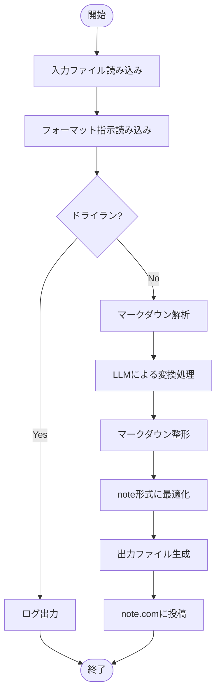
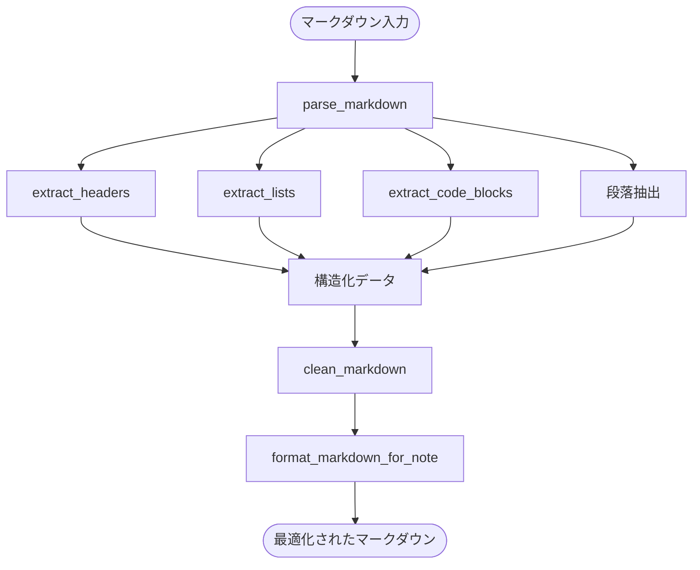

# note記事化システム 詳細設計書

## 1. システム構成

### 1.1 ディレクトリ構造
```
Docs/
├── research/                  # 入力となるLLM調査結果
├── templates/                 # テンプレートファイル
│   └── note_format_prompt.md  # note記事フォーマット指示
└── note-converter/           # 変換・投稿システム
    ├── scripts/              # 変換・投稿スクリプト
    │   ├── note_converter.py      # メインスクリプト
    │   ├── note_api_client.py     # note.com APIクライアント
    │   ├── openrouter_client.py   # OpenRouter APIクライアント
    │   └── utils/                 # ユーティリティ
    │       ├── markdown_utils.py  # Markdown処理
    │       └── error_handler.py   # エラーハンドリング
    ├── tests/                 # テストコード
    │   ├── unit/              # ユニットテスト
    │   └── integration/       # 統合テスト
    ├── docker/               # Docker関連ファイル
    │   ├── Dockerfile        # 開発・テスト用Dockerfile
    │   ├── docker-compose.yml # ローカル開発環境用
    │   └── entrypoint.sh     # コンテナ起動スクリプト
    ├── .github/              # GitHub Actions設定
    │   └── workflows/        # CI/CDワークフロー
    │       ├── test.yml      # テスト自動化
    │       └── deploy.yml    # デプロイ
    ├── requirements.txt      # Python依存関係
    └── README.md            # プロジェクト説明
```

### 1.2 成果物一覧
1. **スクリプト**
   - `note_converter.py`: メイン処理スクリプト
   - `note_api_client.py`: note.com APIクライアント
   - `openrouter_client.py`: OpenRouter APIクライアント
   - `markdown_utils.py`: Markdown処理ユーティリティ
   - `error_handler.py`: エラーハンドリングユーティリティ

2. **テンプレート**
   - `note_format_prompt.md`: note記事フォーマット指示

3. **テスト**
   - ユニットテスト
   - 統合テスト
   - APIモック

4. **CI/CD設定**
   - GitHub Actionsワークフロー
   - 環境変数設定
   - Docker設定

5. **Docker関連**
   - Dockerfile
   - docker-compose.yml
   - エントリーポイントスクリプト

## 2. 詳細仕様

### 2.1 note.com API実装詳細

#### 2.1.1 認証方式
- **セッションベース認証**
  - note.comにログインし、セッションクッキーを取得
  - クッキーはGitHub Secretsで管理
  - セッション有効期限は24時間
  - 期限切れ時は自動再認証

#### 2.1.2 APIエンドポイント
```python
# 下書き投稿
POST https://note.com/api/v1/notes/draft
Headers:
  - Cookie: session=xxx
  - X-CSRF-Token: xxx
Body:
  - body: HTMLコンテンツ
  - index: false
```

#### 2.1.3 エラーハンドリング
- **認証エラー**
  - セッション切れ: 自動再認証
  - 認証失敗: エラーログ出力、処理中断
- **APIエラー**
  - レートリミット: 指数バックオフでリトライ
  - サーバーエラー: 3回までリトライ
  - その他: エラーログ出力、処理中断

### 2.2 フォーマット指示ファイル

#### 2.2.1 基本構造
```markdown
# note記事フォーマット指示

## 1. 記事構成
- 導入部: 読者の興味を引く一文
- 目次: 3〜5個の大項目
- 本文: 段落は3〜4行
- 具体例: 実例やエピソード
- まとめ: 主要ポイントと行動喚起

## 2. スタイルガイド
- 見出し: H2, H3を効果的に使用
- 段落: 適度な空白を設ける
- 強調: 太字、イタリック体を適切に使用
- リスト: 箇条書き、ナンバリングを活用

## 3. SEO対策
- キーワード: 見出しに含める
- ハッシュタグ: 関連タグを設定
- メタ情報: 適切な説明文

## 4. エンゲージメント
- 問いかけ: 読者への質問
- コメント: 意見交換を促す
- リンク: 関連記事への誘導
```

### 2.3 エラーハンドリング詳細

#### 2.3.1 エラー種別と対応
1. **入力エラー**
   - ファイル読み込み失敗
   - フォーマット不正
   - 対応: エラーログ出力、処理中断

2. **APIエラー**
   - 認証エラー
   - レートリミット
   - サーバーエラー
   - 対応: リトライ、エラーログ出力

3. **変換エラー**
   - LLM応答不正
   - フォーマット違反
   - 対応: 再変換、エラーログ出力

#### 2.3.2 ログ形式
```json
{
  "timestamp": "YYYY-MM-DD HH:MM:SS",
  "level": "ERROR|WARN|INFO",
  "error_type": "AUTH|API|CONVERSION",
  "message": "エラーメッセージ",
  "context": {
    "file": "ファイル名",
    "line": "行番号",
    "stack_trace": "スタックトレース"
  }
}
```

### 2.4 テスト戦略

#### 2.4.1 テスト種別
1. **ユニットテスト**
   - 各モジュールの単体テスト
   - モックを使用したAPIテスト
   - カバレッジ目標: 80%以上

2. **統合テスト**
   - エンドツーエンドテスト
   - API連携テスト
   - エラーハンドリングテスト

3. **負荷テスト**
   - 同時処理テスト
   - レートリミットテスト

#### 2.4.2 テスト環境
- 開発環境: モックAPI
- ステージング環境: 実際のAPI
- 本番環境: 実際のAPI

### 2.5 コスト管理

#### 2.5.1 OpenRouter APIコスト
- モデル: `anthropic/claude-3.5-sonnet`
- 料金: $0.0025/1Kトークン
- 予算: 月額$50
- 監視: 使用量ログ

#### 2.5.2 コスト最適化
- トークン使用量の最適化
- キャッシュの活用
- バッチ処理の検討

## 3. 実装計画

### 3.1 フェーズ1: 基本機能
1. ディレクトリ構造作成
2. フォーマット指示ファイル作成
3. 基本スクリプト実装
4. ユニットテスト作成

### 3.2 フェーズ2: API連携
1. note.com APIクライアント実装
2. OpenRouter APIクライアント実装
3. 統合テスト作成

### 3.3 フェーズ3: エラーハンドリング
1. エラーハンドリング実装
2. ログ機能実装
3. テスト拡充

### 3.4 フェーズ4: CI/CD
1. GitHub Actionsワークフロー作成
2. 環境変数設定
3. デプロイテスト

## 4. リスク管理

### 4.1 技術的リスク
- note.com APIの変更
- OpenRouter APIの不安定性
- セキュリティリスク

### 4.2 運用リスク
- コスト超過
- パフォーマンス低下
- メンテナンス負荷

### 4.3 対策
- 定期的なAPI監視
- コスト監視
- バックアップ計画

## 5. Docker環境

### 5.1 開発環境
- **ベースイメージ**: `python:3.11-slim`
- **依存関係**: `requirements.txt`からインストール
- **ボリュームマウント**: ソースコード、設定ファイル
- **環境変数**: APIキー、設定値

### 5.2 テスト環境
- 開発環境と同じDockerfileを使用
- テスト実行用のエントリーポイント
- テスト結果の出力先設定

### 5.3 CI/CD環境
- GitHub Actions上で同じDockerイメージを使用
- キャッシュの活用による高速化
- テスト結果のアーティファクト保存

## 6. テスト自動化

### 6.1 ローカル開発環境
```bash
# テスト実行
docker-compose run --rm test

# 特定のテスト実行
docker-compose run --rm test pytest tests/unit/test_note_converter.py
```

### 6.2 CI/CDパイプライン
```yaml
# .github/workflows/test.yml
name: Test
on:
  push:
    paths:
      - 'Docs/note-converter/**'
  pull_request:
    paths:
      - 'Docs/note-converter/**'

jobs:
  test:
    runs-on: ubuntu-latest
    steps:
      - uses: actions/checkout@v3
      - name: Build and run tests
        run: |
          cd Docs/note-converter
          docker-compose run --rm test
```

### 6.3 テスト結果の管理
- テスト結果のXML出力
- カバレッジレポートの生成
- テスト結果のアーティファクト保存

## 7. 開発フロー

### 7.1 ローカル開発
1. リポジトリをクローン
2. Dockerイメージをビルド
3. 開発コンテナを起動
4. コード編集とテスト実行
5. 変更をコミット

### 7.2 CI/CDフロー
1. コード変更をプッシュ
2. GitHub Actionsがトリガー
3. Dockerイメージをビルド
4. テストを実行
5. 結果を通知

## 8. モジュール構成と処理フロー

### 8.1 モジュール構成図

```
+-------------------+      +------------------+      +------------------+
|                   |      |                  |      |                  |
|  note_converter.py+----->+ openrouter_client+----->+    LLM API      |
|   (メインスクリプト) |      |     (API連携)    |      |  (外部サービス)  |
|                   |      |                  |      |                  |
+--------+----------+      +------------------+      +------------------+
         |
         |
         v
+--------+----------+      +------------------+      +------------------+
|                   |      |                  |      |                  |
|  markdown_utils.py+----->+  note_api_client +----->+   note.com API  |
|  (マークダウン処理)  |      |    (API連携)     |      |  (外部サービス)  |
|                   |      |                  |      |                  |
+-------------------+      +------------------+      +------------------+
```

### 8.2 モジュールの役割

#### 8.2.1 メインモジュール
- **note_converter.py**: システム全体の制御とワークフローの管理
  - コマンドライン引数の処理
  - 入力ファイルの読み込み
  - 各処理モジュールの呼び出し制御
  - エラーハンドリングとログ出力

#### 8.2.2 ユーティリティモジュール
- **markdown_utils.py**: マークダウン処理に特化したユーティリティ
  - `parse_markdown`: マークダウンを構造化データに変換
  - `extract_headers`: 見出し抽出と階層構造分析
  - `extract_lists`: リスト項目と階層関係の抽出
  - `extract_code_blocks`: コードブロックとその言語情報の抽出
  - `format_markdown_for_note`: note.com向け最適化
  - `clean_markdown`: 余分な空白行や書式の整理

#### 8.2.3 API連携モジュール（予定）
- **openrouter_client.py**: LLM API連携
  - API認証と接続管理
  - プロンプト生成と送信
  - レスポンス処理とエラーハンドリング

- **note_api_client.py**: note.com API連携
  - セッションベース認証
  - 記事下書き投稿処理
  - エラー処理とリトライ機能

#### 8.2.4 エラーハンドリング（予定）
- **error_handler.py**: エラー処理共通モジュール
  - 例外の捕捉と分類
  - ログ出力フォーマット
  - リトライ制御

### 8.3 全体処理フロー



### 8.4 マークダウン処理フロー詳細



### 8.5 現在の実装状況

#### 8.5.1 実装済みモジュール
- **note_converter.py**: 基本的なワークフロー処理
  - コマンドライン引数の処理
  - ファイル読み込み・出力処理
  - ドライランモード

- **markdown_utils.py**: マークダウン処理ユーティリティ
  - すべての基本機能実装完了
  - テストカバレッジ96%達成

#### 8.5.2 実装予定モジュール
- **openrouter_client.py**: LLM API連携
- **note_api_client.py**: note.com API連携
- **error_handler.py**: エラー処理共通モジュール

#### 8.5.3 テスト状況
- **ユニットテスト**: 実装済みモジュールのテスト完了
- **統合テスト**: 一部実装、今後拡充予定

### 8.6 今後の実装計画

1. **OpenRouter API連携**
   - LLMプロンプト生成機能
   - APIレスポンス処理
   - エラーハンドリング

2. **note.com API連携**
   - セッション認証機能
   - 下書き投稿機能
   - 記事メタデータ設定

3. **CI/CD拡充**
   - デプロイパイプライン拡充
   - 自動化スクリプト改善

4. **エラーハンドリング強化**
   - 共通エラー処理の実装
   - ロギング機能の拡充 